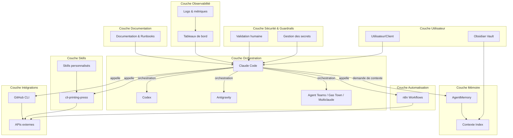

# Architecture Agentic OS

Ce document décrit l'architecture détaillée de l'Agentic OS, conçu pour être modulaire, reproductible et sécurisé.

## 1. Vue d'ensemble

L'Agentic OS propose un cadre permettant de piloter des projets d'IA, de marketing et de contenu. La couche d'orchestration est assurée par Claude Code, qui peut déléguer des sous-tâches à Codex, Antigravity et d'autres agents. Une couche de mémoire persistante (AgentMemory) capture et compresse toutes les interactions. La couche de skills s'appuie sur cli-printing-press, et l'automatisation est gérée par n8n auto-hébergé.

## 2. Diagramme d'architecture

## 3. Description des couches

### 3.1 Couche Utilisateur
- **Interface CLI** : Points d'entrée via Claude Code, Codex, Antigravity.
- **Interface web** : Accès aux workflows n8n et à la console AgentMemory.
- **Obsidian Vault** : Base de connaissances locale pour la rédaction et la consultation de notes.

### 3.2 Couche Orchestration
- **Claude Code** : Orchestrateur principal qui interprète les objectifs, planifie et coordonne.
- **Codex** : Agent spécialisé dans les tâches de développement code-centric.
- **Antigravity** : IDE agentique pour les tâches complexes nécessitant navigateur et terminal.
- **Agent Teams** : Orchestration multi-agents pour les tâches réparties.

### 3.3 Couche Mémoire
- **AgentMemory** : Serveur de mémoire persistant qui capture, compresse et indexe les interactions.
- **Index de contexte** : Mappe les documents et tags pour faciliter la recherche.

### 3.4 Couche Skills
- **cli-printing-press** : Générateur de CLI et serveurs MCP à partir d'API.
- **Skills personnalisés** : Scripts spécifiques consignés dans le dossier `skills/`.

### 3.5 Couche Automatisation
- **n8n self-hosted** : Plate-forme d'automatisation pour créer des workflows visuels (synchronisation, scraping, alertes).

### 3.6 Couche Intégrations
- **GitHub CLI (gh)** : Gestion des dépôts, issues et pull requests.
- **Autres** : Modules n8n vers divers services (Slack, Notion, Google Sheets).

### 3.7 Couche Sécurité / Guardrails
- Gestion des secrets via `.env`.
- Permissions granulaires et validation humaine pour les actions critiques.
- Listes blanches d'outils et d'agents.

### 3.8 Couche Observabilité
- Logs centralisés des prompts et appels d'outils.
- Tableaux de bord pour le suivi des métriques (coûts, tokens, erreurs).

### 3.9 Couche Documentation
- Documentation versionnée (README, ARCHITECTURE, OPERATING_MANUAL).
- Runbooks et templates pour l'industrialisation.
